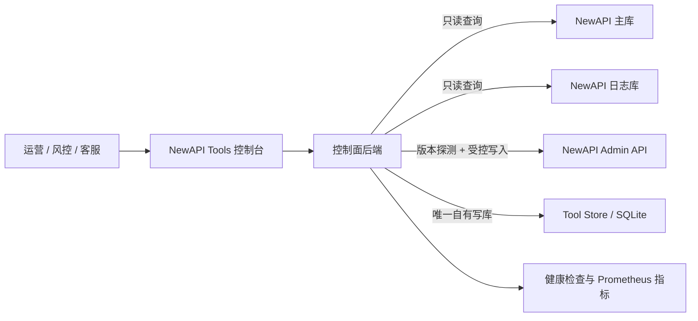

<p align="center">
  
</p>

<p align="center">
  
  
  
  
  
</p>

# NewAPI Tools v0.5.1

NewAPI Tools 是面向 [QuantumNous/new-api](https://github.com/QuantumNous/new-api) 的**独立、旁路、可审计的 API 中转站经营与可靠性控制台**。

它不接管模型代理流量，不修改 NewAPI 源码或表结构，也不把自己伪装成财务账本。它通过旁路读取 NewAPI 主库与日志库、受控调用 NewAPI Admin API，并把自身的审计与运营状态写入独立 Tool Store，为运营人员回答三类问题：

- 服务是否健康，依赖是否退化；
- 渠道和用户发生了什么，证据能否追溯；
- 高风险操作是否经过授权、说明理由并留下完整结果。

> v0.5.1 的核心不是增加更多后台 CRUD，而是把信任边界、失败关闭、操作对账和发行回滚真正做成可恢复的闭环。

## 架构边界



| 边界 | v0.5.1 行为 |
|---|---|
| 代理流量 | 不在 NewAPI 请求链路中，不代理或修改模型请求 |
| NewAPI schema | 不创建、不迁移、不修改 NewAPI 表结构 |
| NewAPI 数据读取 | 主库和可选日志库仅作为旁路 Read Store |
| NewAPI 数据写入 | 只走经过版本能力探测的 Admin API 适配器 |
| 工具私有数据 | 只写入独立 SQLite Tool Store |
| 未知上游版本 | 默认只读，拒绝未经验证的写操作 |

## v0.5.1 能力

| 模块 | 能力与安全边界 |
|---|---|
| Tool Store | 保存不可变操作审计、风险案件与事件、客服备注、价格快照和对账运行记录 |
| NewAPI 适配器 | 探测上游版本与写入能力；限制响应体、禁止重定向并传播 request ID |
| 受控变更 | 用户启停/删除、兑换码生成/删除经 Admin API 执行，并记录 intent 与 outcome |
| RBAC | `viewer`、`operator`、`admin` 三种角色；高风险操作要求 admin |
| 健康检查 | 区分进程存活、服务就绪、数据库、日志新鲜度、Tool Store 与 NewAPI 依赖 |
| 可观测性 | Prometheus 兼容指标覆盖请求、延迟、依赖、控制面操作与构建身份 |
| 搜索与时间线 | 跨 NewAPI 主库、日志库与 Tool Store 搜索；统一用户时间线使用稳定游标并可分源降级 |
| 渠道质量 | 按 1h、24h、7d 窗口汇总成功率、quota、延迟、最后请求和置信度 |
| 请求追踪 | 全局生成/接收 `X-Request-ID`，写入日志、审计记录并向 NewAPI 传播 |
| 发行完整性 | 多架构镜像、OCI revision 校验、tag/digest 固定与失败前保留旧服务 |

渠道质量最多采样 50,000 条日志，按 channel 汇总 NewAPI `type=2/5` 记录，`use_time` 以秒统计平均值和 p95。该报告只提供证据与置信度，不会自动封禁渠道、切流或推断利润。

## NewAPI 版本与写入限制

v0.5.1 的已验证契约基线是 **NewAPI `v1.0.0-rc.21`**。

| NewAPI 版本 | 控制面策略 |
|---|---|
| `v1.0.0-rc.21` | 已验证用户管理和兑换码管理；硬删除保持禁用 |
| `v1.0.0-rc.22` | 允许经过能力探测和 admin 授权的硬删除 |
| 稳定版 `v1.0.0+` | 已知 1.x 版本按能力矩阵启用已验证操作 |
| 未知格式或未来未知主版本 | 强制只读，不尝试猜测兼容性 |

所有 NewAPI 写操作都要求：

1. 配置独立的 `NEWAPI_ADMIN_ACCESS_TOKEN` 与 `NEWAPI_ADMIN_USER_ID`；
2. 上游版本能力探测通过；
3. 调用者具有所需 RBAC 角色；
4. 提供非空操作理由；
5. 提供 `Idempotency-Key`；
6. 在调用前写入 intent，在调用后写入 outcome。

兑换码生成只允许 `admin`。明文只在当前创建响应（或“上游已应用但 outcome 审计失败”的一次性救援响应）中交付，不写入 Tool Store；历史页面只保留指纹。关闭结果弹窗后前端会清空明文，无法从审计历史恢复。遇到 `do_not_retry=true` 时必须先对账，不能重新生成。

## Tool Store 与审计闭环

Tool Store 默认位于 `DATA_DIR/control-plane.db`，也可以用 `TOOL_STORE_PATH` 指定。它与 NewAPI 数据库完全分离，使用单连接 SQLite、WAL、`synchronous=FULL`、内置迁移和启动健康检查；同步级别被降为 `NORMAL` 等非 FULL 值时，readiness 会失败关闭。

| 数据 | 用途 |
|---|---|
| Operation Audits | 保存操作主体、认证方式、理由、目标、request ID、幂等键和执行结果 |
| Risk Cases / Events | 管理风险案件及只追加事件时间线 |
| Support Notes | 保存客服或运营备注及变更审计 |
| Price Snapshots | 保存带来源与生效时间的价格证据 |
| Reconciliation Runs | 保存对账运行状态、范围与摘要 |

Tool Store 是控制台自己的证据库，不会向 NewAPI 创建 sidecar 表。

## RBAC

| 角色 | 权限 |
|---|---|
| `viewer` | 只读查询、健康诊断、审计查看 |
| `operator` | viewer 权限及常规运营写操作 |
| `admin` | operator 权限及永久删除、价格快照等高风险操作 |

- 管理密码登录签发的 JWT 当前赋予 `admin`。
- `API_KEY_ROLE` 控制 API Key 身份，默认是最小权限的 `viewer`。
- 只有明确需要写操作时才显式提升为 `operator` 或 `admin`。

## 健康、指标与请求 ID

| 端点 | 认证 | 用途 |
|---|---|---|
| `GET /livez` | 无 | 进程存活检查 |
| `GET /readyz` | 无 | 服务就绪检查，供容器编排使用 |
| `GET /api/health` | 无 | 基础健康摘要 |
| `GET /api/health/db` | 无 | 数据库健康摘要，不泄漏底层 DSN |
| `GET /api/health/dependencies` | JWT / API Key | 主库、日志库、Redis、Tool Store、NewAPI 依赖诊断 |
| `GET /api/control-plane/newapi/capabilities` | JWT / API Key | 当前 NewAPI 版本和控制面能力矩阵 |
| `GET /metrics` | 独立 Bearer token | Prometheus 兼容指标；未配置 token 时返回 404 |

`/metrics` 必须配置 `OBSERVABILITY_TOKEN`，并使用：

```bash
curl -fsS \
  -H "Authorization: Bearer <OBSERVABILITY_TOKEN>" \
  http://127.0.0.1:1145/metrics
```

每个请求都会返回 `X-Request-ID`。调用方可以传入合规 ID，也可以让服务生成；同一 ID 会进入访问日志、Tool Store 审计和 NewAPI 上游请求。

## 控制面 API

以下端点都位于受认证的 `/api` 路由组中。

### 搜索、时间线与渠道质量

- `GET /api/control-plane/search?q=&limit=`
- `GET /api/control-plane/users/:id/timeline?before=&limit=`
- `GET /api/control-plane/channel-quality?window=1h|24h|7d`

搜索和时间线会按数据源独立降级：某个可选表缺失时，其他来源仍可返回结果。时间线游标稳定绑定用户与分页位置，不能跨用户复用。

### Tool Store

- `GET /api/control-plane/operation-audits`
- `GET /api/control-plane/operation-audits/:id`
- `GET /api/control-plane/operations/:idempotency_key`
- `POST|GET /api/control-plane/risk-cases`
- `GET|PUT /api/control-plane/risk-cases/:id`
- `POST|GET /api/control-plane/risk-cases/:id/events`
- `POST|GET /api/control-plane/support-notes`
- `PUT|DELETE /api/control-plane/support-notes/:id`
- `POST|GET /api/control-plane/price-snapshots`
- `GET /api/control-plane/reconciliation-runs`
- `GET /api/control-plane/reconciliation-runs/:id`

### 经过 NewAPI Admin API 的变更

- `POST /api/control-plane/users/:user_id/disable`
- `POST /api/control-plane/users/:user_id/enable`
- `DELETE /api/control-plane/users/:user_id`
- `POST /api/control-plane/redemptions`
- `DELETE /api/control-plane/redemptions/:id`
- `POST /api/control-plane/redemptions/batch-delete`

上述受支持写请求必须带 `Idempotency-Key`，并在 JSON 请求体中提供理由。该键标识当前认证主体的一次逻辑写操作：仅在重试同一路由/动作、同一目标和同一请求体时复用；变更目标或负载必须生成新键，冲突复用返回 `409`。永久删除还要求 `admin` 角色和上游版本能力通过。

v0.5.1 遇到网络中断、上游超时或审计尾部失败时，不会根据页面当前状态猜测结果，也不会盲目重放原请求。浏览器会保留无敏感负载的 pending marker，并通过 `GET /api/control-plane/operations/:idempotency_key` 读取与当前 actor、认证方式、动作和目标绑定的完整 intent/outcome 链；只有可证明的终态才能释放本地提交锁，损坏或孤立审计链返回 `503` 并继续失败关闭。

兑换码创建要求 `admin`。创建的 `count` 和批量删除的 `ids` 均限制为每次请求 `1..100`；单码额度和单次总额度还分别受 `REDEMPTION_MAX_QUOTA_PER_CODE`、`REDEMPTION_MAX_TOTAL_QUOTA` 限制，默认约为 US$100/码和 US$1000/次。所有限制都在写入 intent 和调用 NewAPI 前执行；服务端不会自动拆分。安全重试由 `Idempotency-Key`、请求绑定和 intent/outcome 审计共同保证，而不是由批次大小保证。

## 已禁用或降级的危险旧功能

v0.5.1 继续缩小自动化写入面。下面的旧能力不得视为可用的自动风控：

| 旧能力 | v0.5.1 状态 |
|---|---|
| Abuse Broadcast sidecar 表和后台写入器 | 不挂载；由 Tool Store 风险案件替代 |
| AI 自动评估、自动扫描、连接测试 | 返回 `501 NOT_IMPLEMENTED` |
| 自动分组执行、批量移动、回滚 | 仅预览或返回 501 |
| 批量删除不活跃用户 | 仅预览 |
| 批量永久清理 | 仅预览或禁用 |
| Token 批量变更 | 无版本化适配器，返回 501 |
| 批量开启 IP 记录 | 返回 501 |
| Storage 通用配置入口（GET/POST/DELETE） | 全部返回 501；v0.5.1 不提供通用配置读取或写入 |
| 自动创建数据库索引 | 禁用，只列出建议 |
| 缓存 warmup 状态 | 返回 501；请使用健康接口 |
| 解封后批量恢复 Token | 不执行，避免复活已泄漏凭据 |

## 快速部署

### 一键安装

```bash
INSTALLER_COMMIT_SHA=80199a9182c9c2e4c8771b4c90fac2952ee0f331
INSTALL_SCRIPT_SHA256=300eebfd65fda0d13914f4222ad212a3277660d2f5bdf01ef0f57761e2bd4185
install_script="$(mktemp)"
trap 'rm -f "$install_script"' EXIT
curl --proto '=https' --tlsv1.2 --fail --silent --show-error --location \
  "https://raw.githubusercontent.com/yujianwudi/new_api_tools/${INSTALLER_COMMIT_SHA}/install.sh" \
  --output "$install_script"
printf '%s  %s\n' "$INSTALL_SCRIPT_SHA256" "$install_script" | sha256sum -c -
NEWAPI_TOOLS_REF=v0.5.1 \
NEWAPI_TOOLS_IMAGE=ghcr.io/yujianwudi/new_api_tools@sha256:<MANIFEST_DIGEST> \
NEWAPI_TOOLS_EXPECTED_REVISION=<RELEASE_COMMIT_SHA> \
bash "$install_script"
```

安装器 commit 与 SHA-256 已固定在本仓库文档中。执行前仍必须从 v0.5.1 发行页复制并替换 `<MANIFEST_DIGEST>` 与 `<RELEASE_COMMIT_SHA>`；任一占位符未替换时不要执行。

安装器会：

- 检测现有 NewAPI 容器、网络、主库和可选 `LOG_SQL_DSN`；
- 生成管理密码、API Key、JWT secret 等必要密钥；
- 在停止旧服务前递归预拉取应用、不可变镜像策略门禁和固定 digest 的 Redis，只重建 `newapi-tools` 运行服务；
- 把 release tag 对应镜像解析并固定到 OCI digest；
- 校验镜像 `org.opencontainers.image.revision`；
- 在拉取候选前为现有镜像建立不可变回滚锚点：已有 digest 原样保留，旧 mutable tag 必须能从本地镜像唯一解析为同仓库 RepoDigest，否则升级在 pull/down 前失败关闭；
- 候选镜像只有在 revision 校验通过、`docker compose up -d --wait --wait-timeout 180` 成功且语义 readiness（含 Tool Store）健康后才提交到 `.env`。拉取、启动、健康或配置提交失败都会恢复旧 Compose overlay、network、project identity 与旧 digest。

默认监听 `127.0.0.1:1145`。生产环境应使用宿主机 Nginx/Caddy 提供 HTTPS；不要在缺少访问控制时把 `FRONTEND_BIND` 改为 `0.0.0.0`。

### 手动部署

v0.5.1 全部 Compose 路径要求 Docker Compose v2.24.0 或更高版本；旧版 `docker-compose` v1 会被安装/部署脚本拒绝。

```bash
git clone --branch v0.5.1 --depth 1 https://github.com/yujianwudi/new_api_tools.git
cd new_api_tools
cp .env.example .env
# 填写 .env 中的 NewAPI/认证配置后，从发行页复制以下两个真实值：
NEWAPI_TOOLS_IMAGE=ghcr.io/yujianwudi/new_api_tools@sha256:<MANIFEST_DIGEST> \
NEWAPI_TOOLS_EXPECTED_REVISION=<RELEASE_COMMIT_SHA> \
bash ./deploy.sh
```

直接运行 Compose 时，不可变镜像策略门禁会拒绝空值、tag 或格式不完整的 digest，但不会替你校验 OCI revision。发行部署应使用上面的 `deploy.sh` 流程，同时绑定 manifest digest 与 40 位发行 commit。

稳定部署应直接指定不可变镜像：

```dotenv
NEWAPI_TOOLS_IMAGE=ghcr.io/yujianwudi/new_api_tools@sha256:<MANIFEST_DIGEST>
```

## 关键配置

| 变量 | 说明 | 默认/建议 |
|---|---|---|
| `NEWAPI_TOOLS_IMAGE` | 部署镜像；手动部署必须使用 `repo@sha256:digest` | 无默认值；安装/部署脚本自动解析并持久化 digest |
| `NEWAPI_TOOLS_EXPECTED_REVISION` | 镜像必须匹配的 40 位 Git commit | 显式镜像时必填；从发行页复制 |
| `SQL_DSN` | NewAPI 主库 DSN | 必填 |
| `LOG_SQL_DSN` | 可选日志分库 DSN；留空回落主库 | 可选 |
| `NEWAPI_BASEURL` | NewAPI 内部基地址 | 如 `http://new-api:3000` |
| `NEWAPI_ADMIN_ACCESS_TOKEN` | 独立 NewAPI 管理凭据 | 写操作必填 |
| `NEWAPI_ADMIN_USER_ID` | 管理员用户 ID | 写操作必填 |
| `REDEMPTION_MAX_QUOTA_PER_CODE` | 单个兑换码最大 quota | `50000000`（约 US$100） |
| `REDEMPTION_MAX_TOTAL_QUOTA` | 单次生成最大总 quota | `500000000`（约 US$1000） |
| `TOOL_STORE_PATH` | 独立 Tool Store 路径 | `DATA_DIR/control-plane.db` |
| `ADMIN_PASSWORD` | 控制台登录密码 | 必填，安装器生成 |
| `API_KEY` | 控制台 API Key | 必填，安装器生成 |
| `API_KEY_ROLE` | API Key 角色 | `viewer`；写操作需显式提升 |
| `JWT_SECRET` | JWT 签名密钥 | 必填，安装器生成 |
| `JWT_EXPIRE_HOURS` | JWT 有效时间 | `24`；高风险环境建议缩短 |
| `OBSERVABILITY_TOKEN` | `/metrics` 独立 Bearer token | 留空时端点返回 404 |
| `LOG_FRESHNESS_MAX_SECONDS` | 日志过旧诊断阈值 | `900` |
| `GEOIP_AUTO_DOWNLOAD` | 启动时下载固定版本 GeoIP 数据库 | `false`；默认使用镜像内或手工挂载文件 |
| `GEOIP_AUTO_UPDATE` | 允许运行时更新固定版本 GeoIP 数据库 | `false`；仅在下载开关同时开启时生效 |
| `FRONTEND_BIND` | 宿主机监听地址 | `127.0.0.1` |
| `FRONTEND_PORT` | 控制台端口 | `1145` |
| `TRUSTED_PROXY_CIDRS` | 允许解析 XFF 的精确代理地址 | `127.0.0.1/32,::1/128` |
| `CORS_ALLOWED_ORIGINS` | 精确可信 Origin，逗号分隔 | 留空仅同源 |

完整示例见 [`.env.example`](./.env.example)。

## 升级与验证

升级前备份配置和 Tool Store。下面的 Compose 示例从运行中容器解析实际的 `TOOL_STORE_PATH`（未显式配置时按 `DATA_DIR/control-plane.db` 解析），然后先停止服务再复制 SQLite；不要在服务运行时直接 `cp` 数据库文件：

```bash
backup_dir="backups/v0.5.1-$(date +%Y%m%d%H%M%S)"
mkdir -p "$backup_dir"
cp -- .env "$backup_dir/.env"

tool_store_path="$(
  docker compose exec -T newapi-tools \
    sh -c 'readlink -f "${TOOL_STORE_PATH:-${DATA_DIR:-./data}/control-plane.db}"'
)"
docker compose exec -T newapi-tools test -f "$tool_store_path" || {
  echo "Tool Store 不存在或不可读: $tool_store_path" >&2
  exit 1
}
(
  set -e
  trap 'docker compose start newapi-tools >/dev/null' EXIT
  docker compose stop newapi-tools
  docker compose cp "newapi-tools:${tool_store_path}" "$backup_dir/control-plane.db"
  docker compose start newapi-tools
  trap - EXIT
)
```

不能停机时，必须针对解析后的宿主机数据库路径使用 SQLite Online Backup API（例如 `sqlite3` 的 `.backup`），不能用普通文件复制替代一致性备份。自定义 `TOOL_STORE_PATH` 还必须有对应的持久化卷映射。

升级后至少执行：

```bash
docker compose ps
curl -fsS http://127.0.0.1:1145/livez
curl -fsS http://127.0.0.1:1145/readyz
docker compose logs --tail=200 newapi-tools
```

依赖诊断需要 JWT 或 API Key；`/metrics` 需要独立观测 token。更完整的升级、回滚和兼容性说明见 [`RELEASE_0.5.1.md`](./RELEASE_0.5.1.md)。

## 回滚

恢复升级前记录并核验过的 OCI digest：

```dotenv
NEWAPI_TOOLS_IMAGE=ghcr.io/yujianwudi/new_api_tools@sha256:<previous-digest>
```

```bash
docker compose pull --include-deps newapi-tools
docker compose up -d --force-recreate --wait --wait-timeout 180 newapi-tools
```

Tool Store 迁移不承诺自动向下兼容。回滚前必须保留 `.env` 和按实际 `TOOL_STORE_PATH` 创建的数据库备份，不要把应用镜像回滚等同于数据自动降级。

## 开发与审计

```bash
cd backend
go test ./...
go test -race ./...
go vet ./...

cd ../frontend
npm ci
npm run lint
npm run build
npm audit --omit=dev
```

CI 还会执行 `govulncheck`、部署脚本测试、Compose 校验、多架构构建和镜像身份检查。Docker 基础镜像与 Redis 使用多架构 manifest digest 固定；GeoIP 数据固定到提交 `a83d44508ee6831c2770b2c4be91f9850ec429d7`，并在构建和运行时校验 SHA-256 `168b01d10d0742129be1bee92bba85affaaefcf2e86b4187bcf1924ea50068bf`。固定 GeoIP 快照无法下载或校验失败时，镜像构建失败关闭。发布镜像同时生成 SBOM 和 provenance。

## 项目资料

- 路线图：[`docs/ROADMAP.md`](./docs/ROADMAP.md)
- v0.5.1 发行说明：[`RELEASE_0.5.1.md`](./RELEASE_0.5.1.md)
- v0.5.0 发行说明：[`RELEASE_0.5.0.md`](./RELEASE_0.5.0.md)
- 上游项目：[`QuantumNous/new-api`](https://github.com/QuantumNous/new-api)
- 原始项目：[`james-6-23/new_api_tools`](https://github.com/james-6-23/new_api_tools)
- 许可证：[MIT](./LICENSE)
